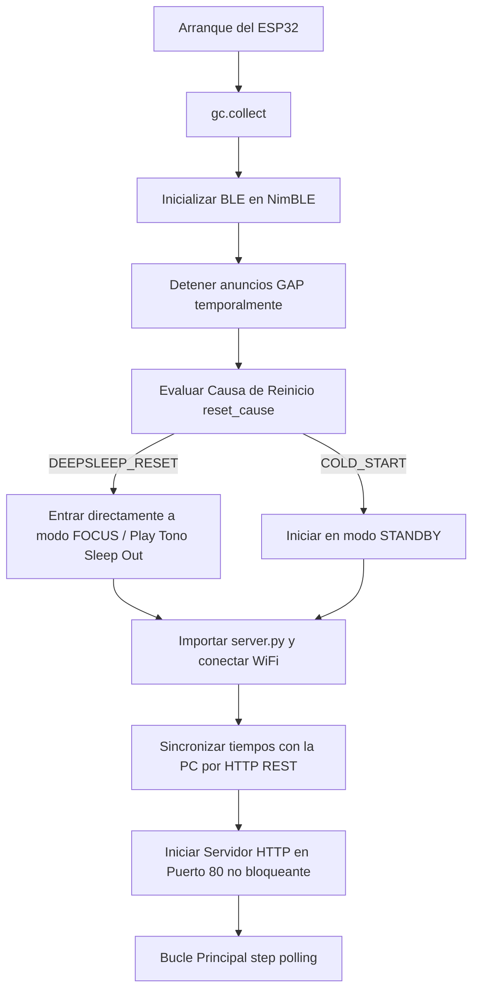
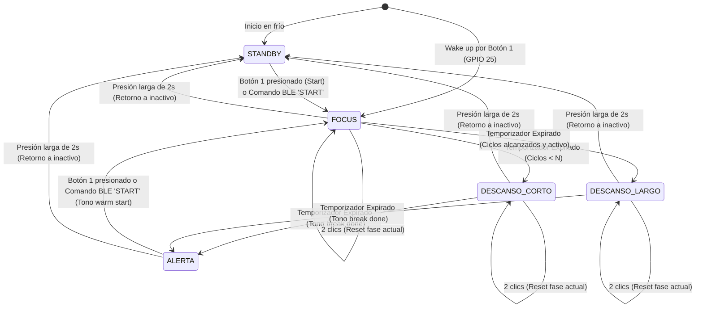

# Manual de Auditoría de Procesos - Pomodoro IoT Timer

Este documento es una guía técnica y de auditoría diseñada para entender la arquitectura, flujo de datos y comportamiento dinámico del firmware MicroPython (ESP32) y del servidor backend de estadísticas (Flask). 

---

## 1. Arquitectura y Estructura de Archivos

El repositorio está dividido en dos grandes componentes: el **Firmware del Dispositivo** (MicroPython para ESP32 en la raíz) y el **Backend de Estadísticas** (Python Flask en la carpeta `/backend`).

### Componentes del Firmware (ESP32)

*   **[main.py](file:///Users/ivanbudnick/Documents/Pomodoro/main.py)**: Punto de entrada principal ejecutado al iniciar el chip. Se encarga de coordinar la secuencia crítica de arranque, inicializar redes y ejecutar el bucle principal no bloqueante.
*   **[config.py](file:///Users/ivanbudnick/Documents/Pomodoro/config.py)**: Centralización de constantes físicas (mapeo de pines GPIO), umbrales del sensor LDR, frecuencias armónicas del zumbador, duraciones por defecto de los intervalos y rutinas de persistencia en Flash (`config.json` y `wifi.json`).
*   **[hardware.py](file:///Users/ivanbudnick/Documents/Pomodoro/hardware.py)**: Capa de abstracción del hardware (Drivers). Controla las señales PWM para el LED RGB y el Buzzer, realiza lecturas analógicas (ADC) filtradas del LDR, gestiona la multiplexación del Display de 7 segmentos mediante temporizadores físicos de hardware, y realiza el filtrado de rebotes (debounce) y gestos del botón 2.
*   **[pomodoro.py](file:///Users/ivanbudnick/Documents/Pomodoro/pomodoro.py)**: Lógica principal del negocio. Implementa la Máquina de Estados Finitos (FSM) no bloqueante, procesa comandos entrantes por BLE/Botones y despacha reportes de red a través de hilos de ejecución de fondo (`_thread`).
*   **[audio.py](file:///Users/ivanbudnick/Documents/Pomodoro/audio.py)**: Biblioteca de perfiles acústicos (tonos y arpegios armónicos) generados a través de ciclos de trabajo del buzzer pasivo.
*   **[ble_uart.py](file:///Users/ivanbudnick/Documents/Pomodoro/ble_uart.py)**: Controlador Bluetooth Low Energy. Registra el perfil del estándar *Nordic UART Service* (NUS), gestiona las conexiones/desconexiones de clientes centrales y expone una cola circular (Buffer RX) para comandos serie.
*   **[server.py](file:///Users/ivanbudnick/Documents/Pomodoro/server.py)**: Servidor de red local de la placa. Controla la conexión Wi-Fi, expone APIs REST en el puerto 80 para configuraciones en vivo, sirve el portal web local y maneja el portal cautivo (WiFi Manager) de configuración en caso de fallo de red.
*   **[dashboard.html](file:///Users/ivanbudnick/Documents/Pomodoro/dashboard.html)**: Interfaz web glassmorphic responsiva almacenada en la flash de la ESP32, servida en fragmentos para optimización de memoria.

### Componentes del Backend (PC)

*   **[backend/app.py](file:///Users/ivanbudnick/Documents/Pomodoro/backend/app.py)**: Servidor Flask centralizado. Escucha reportes REST y MQTT procedentes del dispositivo, almacena el historial en SQLite y provee un panel gráfico interactivo con estadísticas de productividad (Chart.js).
*   **[backend/requirements.txt](file:///Users/ivanbudnick/Documents/Pomodoro/backend/requirements.txt)**: Lista de dependencias del servidor PC (Flask, Paho-MQTT, etc.).
*   **[backend/pomodoro.db](file:///Users/ivanbudnick/Documents/Pomodoro/backend/pomodoro.db)**: Base de datos SQLite local para guardar sesiones finalizadas y configuraciones persistentes.

### Herramientas de Test y Diagnóstico (Utilidades)

*   **[test_display.py](file:///Users/ivanbudnick/Documents/Pomodoro/test_display.py)**: Script interactivo para testear la multiplexación del display 7 segmentos de 4 dígitos y el registro 74HC595 sin iniciar la lógica pomodoro.
*   **[backend/test_ble_client.py](file:///Users/ivanbudnick/Documents/Pomodoro/backend/test_ble_client.py)**: Cliente de terminal escrito en Python (usando la biblioteca `bleak`) para conectarse de forma remota a la ESP32 por Bluetooth y controlar y recibir notificaciones del estado en vivo.

---

## 2. Flujos y Procesos Clave

### A. Proceso de Arranque y Optimización de RAM
El orden de arranque del dispositivo es un factor crítico en MicroPython debido a la fragmentación de la memoria heap que causa fallos de falta de memoria (`ENOMEM`) en el stack Bluetooth (NimBLE).



> [!IMPORTANT]
> **Optimización Crítica**: BLE debe inicializarse e inmediatamente detener sus anuncios *antes* de que cualquier módulo complejo de red (sockets, JSON parsing) sea importado, asegurando un espacio contiguo de memoria heap libre.

---

### B. Ciclos de la Máquina de Estados Finitos (FSM)
La lógica del temporizador está gobernada por una FSM no bloqueante en [pomodoro.py](file:///Users/ivanbudnick/Documents/Pomodoro/pomodoro.py). El flujo cambia según marcas de tiempo calculadas con `time.ticks_ms()`.



---

### C. Gestión de Energía y Deep Sleep
Para conservar batería, la ESP32 entra en Deep Sleep si se detecta inactividad prolongada en el estado `STANDBY`.

1.  **Evaluación de Inactividad**: Se compara `time.ticks_diff(ahora, ultimo_evento_ms)`. Si excede `TIEMPO_INACTIVIDAD_SLEEP_MS` (por defecto 60 segundos), se inicia la desconexión.
2.  **Apagado de Periféricos**: Se apagan los canales PWM del LED RGB, se detienen las interrupciones del display de 7 segmentos y se emite la melodía descendente `play_sleep_in`.
3.  **Configuración del Pin de Despertar**:
    ```python
    wake_pin = machine.Pin(config.PIN_BTN, machine.Pin.IN, machine.Pin.PULL_UP)
    esp32.wake_on_ext0(pin=wake_pin, level=0)
    ```
4.  **Llamada a Deep Sleep**: `machine.deepsleep()`. El microcontrolador reduce su consumo al mínimo (~10-15µA). Al presionar el botón 1 (GPIO 25), el pin cae a nivel bajo (`0`), lo que provoca un reset por hardware que reinicia la ESP32.

---

### D. Sensor Fotoresistencia LDR y Curva de Brillo
El sistema ajusta el brillo del LED de forma dinámica basándose en la luz ambiental:
1.  **Lectura ADC**: Se lee el pin analógico `34`. El valor analógico se restringe entre `LDR_MIN_VAL` (oscuridad) y `LDR_MAX_VAL` (luminosidad de oficina).
2.  **Interpolación**: Se calcula un factor entre `LDR_MIN_FACTOR` (0.05) y `LDR_MAX_FACTOR` (1.0).
3.  **Efecto Cinematográfico**: Durante las fases activas (Focus y Break), el brillo base no es lineal sino exponencial-cuadrático:
    $$\text{Intensidad} = \text{DUTY\_PISO} + \text{progreso\_lineal}^2 \times (\text{DUTY\_MAX} - \text{DUTY\_PISO})$$
    El color empieza muy tenue y se intensifica rápidamente hacia el final, atenuado globalmente por el factor de luz LDR.

---

### E. Driver del Display (74HC595 + Multiplexación)
Para reducir el uso de GPIOs, se utiliza un registro de desplazamiento de 8 bits 74HC595 conectado en cascada a un display cátodo común de 4 dígitos.

*   **SoftSPI**: En lugar de alternar pines en Python (que toma ~250µs por byte e interrumpe la CPU), el driver utiliza `SoftSPI` acelerado por C en MicroPython para enviar el mapa de segmentos en menos de 15µs.
*   **Temporizador Periódico**: El Timer de hardware `0` corre un callback cada 5ms (200Hz).
*   **Persistencia Retiniana**: En cada callback se apagan todos los transistores de control de dígitos (evitando efecto fantasma), se envía el nuevo byte por SPI, y se pone en bajo (`0`) el pin del dígito activo. Se cicla del dígito 0 al 3.

---

### F. Comunicaciones Asíncronas e Hilos de Fondo
Para evitar que las peticiones de red congelen el display de 7 segmentos o pausen el temporizador:
1.  **Reporte de Sesión**: Cuando una fase Focus o Descanso expira, se lanza un hilo independiente usando el módulo `_thread`:
    ```python
    _thread.start_new_thread(_enviar_reporte_thread, (tipo_sesion, ciclo_num, duracion_s))
    ```
2.  **Sockets No Bloqueantes**: El socket del servidor HTTP local de la ESP32 se establece con `server_socket.setblocking(False)`. El bucle principal en `main.py` ejecuta `atender_peticiones_http()` en cada iteración, la cual captura excepciones `OSError` silenciosamente si no hay peticiones entrantes, permitiendo que la FSM siga corriendo sin latencia.
3.  **Fallback de Red**: El hilo intenta primero una petición HTTP REST local a la base de datos de la PC. Si no hay respuesta (timeout), realiza un fallback enviando los datos por MQTT a un broker público (`broker.hivemq.com`).

---

## 3. Guía de Auditoría de Código por Archivo

Al inspeccionar o modificar los archivos, verifica el cumplimiento de las siguientes reglas de diseño:

| Archivo | Regla de Oro / Qué buscar | Impacto de Fallo |
| :--- | :--- | :--- |
| [main.py](file:///Users/ivanbudnick/Documents/Pomodoro/main.py) | Mantener libre de bucles bloqueantes. `time.sleep_ms` dentro del bucle principal debe estar restringido a `config.LOOP_SLEEP_MS` (10ms). | Parpadeo en el display y pérdida de precisión del temporizador. |
| [config.py](file:///Users/ivanbudnick/Documents/Pomodoro/config.py) | Asegurar que `FLASK_SERVER_URL` termine en `/datos` para que los reemplazos automáticos de endpoints no fallen. | Fallo total en la sincronización inicial y guardado de configuraciones. |
| [hardware.py](file:///Users/ivanbudnick/Documents/Pomodoro/hardware.py) | El callback del Timer `refrescar` debe ser lo más corto posible y no contener llamadas de red o logs. | Caídas del sistema por "Timer queue overflow" o "ISR panic". |
| [pomodoro.py](file:///Users/ivanbudnick/Documents/Pomodoro/pomodoro.py) | Modificaciones del estado FSM deben registrar actividad con `registrar_actividad()` para prevenir la entrada a Deep Sleep en medio del uso. | Dispositivo apagándose inesperadamente por inactividad. |
| [ble_uart.py](file:///Users/ivanbudnick/Documents/Pomodoro/ble_uart.py) | Asegurar el vaciado manual del buffer circular en `read()` (operación atómica). | Comandos duplicados o retrasados en el buffer. |
| [server.py](file:///Users/ivanbudnick/Documents/Pomodoro/server.py) | La lectura de `dashboard.html` debe realizarse por bloques de 512 bytes en streaming. No cargues el archivo completo en memoria. | Error fatal `ENOMEM` (Pánico de memoria) al intentar servir el dashboard. |
| [backend/app.py](file:///Users/ivanbudnick/Documents/Pomodoro/backend/app.py) | Asegurar que la inicialización de la base de datos en SQLite (`init_db`) maneje correctamente migraciones y bloqueos de hilos (thread-safety). | Base de datos bloqueada o corrupta al recibir reportes HTTP y MQTT concurrentes. |
