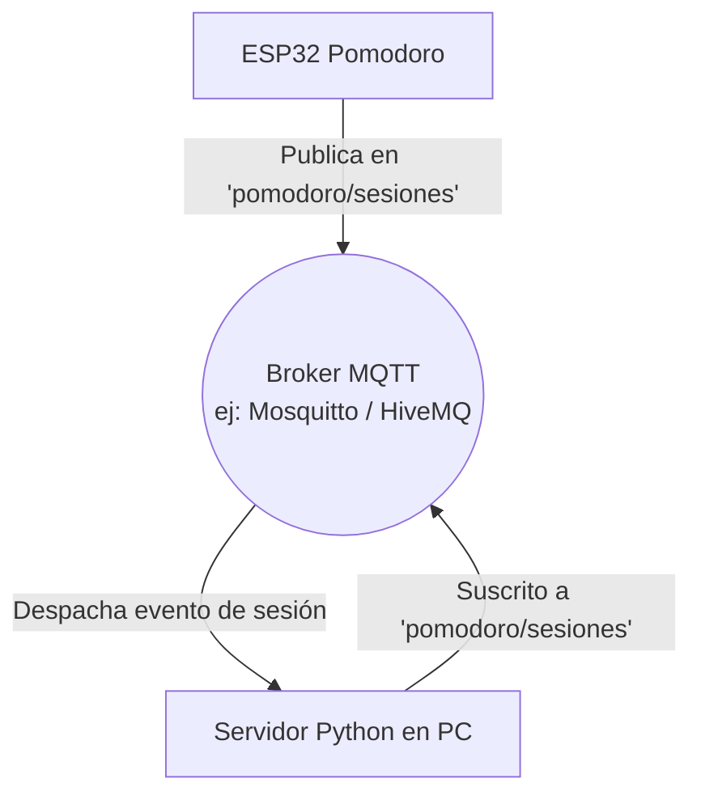

# Propuestas de Arquitectura de Comunicación y Red

Este documento detalla las implicaciones técnicas y las alternativas de diseño para cumplir con los requerimientos de **MQTT / Wi-Fi Manager** y **Conexión entre microcontroladores / Bluetooth** en el proyecto Pomodoro ESP32.

---

## 1. Requerimiento: Uso de MQTT o WI-FI Manager

Este requerimiento busca flexibilizar la conectividad del dispositivo (Wi-Fi Manager) o cambiar el protocolo de transporte a uno optimizado para IoT (MQTT).

### Alternativa A: Implementación de un Wi-Fi Manager (Portal Cautivo)
Implica que el dispositivo no dependa de credenciales "hardcodeadas" (escritas directamente en el código). Si la ESP32 no se puede conectar a la red WiFi guardada en un plazo de tiempo, pasa a actuar como punto de acceso y sirve una interfaz web de configuración.

#### ¿Cómo se implementa en la práctica?
1. Al arrancar, se intenta la conexión en modo **Station (STA)** con las últimas credenciales almacenadas en un archivo `config.json`.
2. Si falla la conexión, se activa la interfaz de **Access Point (AP)**:
   ```python
   import network
   ap = network.WLAN(network.AP_IF)
   ap.active(True)
   ap.config(essid="Configurador-Pomodoro", authmode=network.AUTH_OPEN)
   ```
3. Se levanta un servidor DNS simplificado o un socket en el puerto 80 que responda a cualquier dirección web (redirección) sirviendo un formulario HTML básico.
4. El usuario se conecta a la red WiFi `"Configurador-Pomodoro"` desde su smartphone, se le abre el portal, ingresa las credenciales de su red local, y la ESP32 las escribe en `config.json` y se reinicia.

---

### Alternativa B: Comunicación mediante MQTT (Recomendado)
MQTT es un protocolo de mensajería liviano del tipo **Publicación/Suscripción**. En lugar de que la ESP32 le haga peticiones HTTP POST directamente a la IP de la PC (lo cual falla si la IP de la PC cambia), ambos dispositivos se conectan a un **Broker MQTT** (intermediario de mensajería).

#### Arquitectura de Red MQTT:


#### Código de ejemplo en la ESP32 (MicroPython):
Para enviar reportes de sesión usando la biblioteca estándar `umqtt.simple`:
```python
from umqtt.simple import MQTTClient
import ujson as json

# Configuración del cliente MQTT
MQTT_BROKER = "broker.hivemq.com" # Broker público para pruebas
CLIENT_ID = "esp32_pomodoro_123"
TOPIC_SESIONES = "pomodoro/sesiones"

def reportar_sesion_mqtt(tipo, ciclo, duracion):
    client = MQTTClient(CLIENT_ID, MQTT_BROKER, port=1883)
    try:
        client.connect()
        payload = json.dumps({
            "dispositivo": "ESP32_Real",
            "tipo_sesion": tipo,
            "ciclo_num": ciclo,
            "duracion_s": duracion
        })
        client.publish(TOPIC_SESIONES, payload)
        client.disconnect()
        print("[MQTT] Evento publicado con éxito.")
    except Exception as e:
        print("[MQTT ERROR] No se pudo enviar el mensaje:", e)
```

#### Código de ejemplo en la PC (Servidor Python):
Utilizando la biblioteca `paho-mqtt` para escuchar los datos y guardarlos en la base de datos de SQLite:
```python
import paho.mqtt.client as mqtt
import json
import sqlite3

DB_PATH = "backend/pomodoro.db"

def registrar_en_base_datos(data):
    conn = sqlite3.connect(DB_PATH)
    cursor = conn.cursor()
    cursor.execute('''
        INSERT INTO sesiones_pomodoro (dispositivo, tipo_sesion, ciclo_num, duracion_s)
        VALUES (?, ?, ?, ?)
    ''', (data['dispositivo'], data['tipo_sesion'], data['ciclo_num'], data['duracion_s']))
    conn.commit()
    conn.close()
    print(f"[SQLITE MQTT] Guardada sesión de {data['tipo_sesion']}")

# Callbacks del Cliente MQTT
def on_message(client, userdata, message):
    try:
        payload = message.payload.decode("utf-8")
        data = json.loads(payload)
        registrar_en_base_datos(data)
    except Exception as e:
        print("Error al procesar mensaje MQTT:", e)

client = mqtt.Client()
client.on_message = on_message
client.connect("broker.hivemq.com", 1883)
client.subscribe("pomodoro/sesiones")
client.loop_start() # Bucle en segundo plano para escuchar eventos
```

---

## 2. Requerimiento: Conexión entre dos Microcontroladores o Bluetooth

Este requerimiento busca expandir la comunicación del dispositivo sin depender obligatoriamente de una infraestructura de red WiFi local.

### Alternativa A: Uso de Bluetooth BLE (Bluetooth Low Energy)
La ESP32 integra hardware Bluetooth. Podemos configurarla como un periférico BLE que exponga un servicio de puerto serie virtual (UART). De esta manera, el Pomodoro puede controlarse desde un teléfono o una laptop en forma local sin necesidad de router WiFi.

#### Funcionamiento del Flujo BLE:
```
[ Smartphone / PC ]               [ ESP32 Pomodoro ]
  (Cliente BLE)                     (Servidor BLE)
        |                                  |
        |---- Conexión Bluetooth --------->|
        |<--- Notifica: "FOCUS - 24:59"----|  (Actualización de tiempo)
        |---- Escribe Comando: "PAUSAR"--->|  (Acción del usuario)
```

#### Código básico de inicialización en MicroPython:
El uso de Bluetooth en MicroPython requiere de la biblioteca nativa `bluetooth`. Este es el esqueleto para anunciar el dispositivo y recibir comandos seriales por aire:
```python
import bluetooth
from micropython import const

_IRQ_CENTRAL_CONNECT = const(1)
_IRQ_CENTRAL_DISCONNECT = const(2)
_IRQ_GATTS_WRITE = const(3)

class ESP32_BLE:
    def __init__(self, name="Pomodoro-ESP32"):
        self.ble = bluetooth.BLE()
        self.ble.active(True)
        self.ble.irq(self.ble_irq)
        
        # UUIDs para emular un puerto serie nórdico (BLE UART)
        UART_UUID = bluetooth.UUID("6E400001-B5A3-F393-E0A9-E50E24DCCA9E")
        RX_UUID = bluetooth.UUID("6E400002-B5A3-F393-E0A9-E50E24DCCA9E")
        TX_UUID = bluetooth.UUID("6E400003-B5A3-F393-E0A9-E50E24DCCA9E")
        
        # Registro del servicio UART
        UART_SERVICE = (UART_UUID, (
            (TX_UUID, bluetooth.FLAG_NOTIFY),
            (RX_UUID, bluetooth.FLAG_WRITE | bluetooth.FLAG_WRITE_NO_RESPONSE),
        ))
        
        ((self.tx_handle, self.rx_handle),) = self.ble.gatts_register_services((UART_SERVICE,))
        self.advertise(name)
        
    def advertise(self, name):
        # Configuración de los paquetes de anuncio BLE
        payload = bytearray(b'\x02\x01\x06') # Flags
        payload += bytearray([len(name) + 1, 0x09]) + name.encode('utf-8') # Nombre del dispositivo
        self.ble.gap_advertise(100, payload)
        print("BLE Anunciando dispositivo...")

    def ble_irq(self, event, data):
        if event == _IRQ_CENTRAL_CONNECT:
            print("Dispositivo central conectado por BLE.")
        elif event == _IRQ_CENTRAL_DISCONNECT:
            self.advertise("Pomodoro-ESP32")
        elif event == _IRQ_GATTS_WRITE:
            conn_handle, value_handle = data
            if value_handle == self.rx_handle:
                comando = self.ble.gatts_read(self.rx_handle).decode('utf-8').strip()
                print(f"[BLE COMANDO RECIBIDO]: {comando}")
                self.procesar_comando(comando)

    def enviar_datos(self, texto):
        # Envía datos de estado o tiempo hacia el teléfono conectado
        self.ble.gatts_notify(0, self.tx_handle, texto.encode('utf-8'))

    def procesar_comando(self, cmd):
        # Lógica para vincular con pomodoro.py
        if cmd == "PAUSAR":
            pass # Pausar el pomodoro
        elif cmd == "REANUDAR":
            pass # Reanudar el pomodoro
```

---

### Alternativa B: Conexión entre Dos Microcontroladores (ESP32 <--> Arduino)
Si dispones de un segundo microcontrolador (por ejemplo, un Arduino Nano), puedes delegar tareas. La ESP32 se encargará del motor del Pomodoro, WiFi y Base de Datos, y el Arduino Nano se encargará exclusivamente de manejar la interfaz visual (un Display LCD de caracteres o una Matriz de LEDs).

#### Esquema de cableado Serial (UART):
Se conectan los pines cruzados (TX a RX y RX a TX) y se comparte una tierra común.
```
  [ ESP32 ]                               [ Arduino Nano ]
  Pin 17 (TX2)  ========================> Pin 2 (RX - SoftwareSerial)
  Pin 16 (RX2)  <======================== Pin 3 (TX - SoftwareSerial)
  GND           ========================> GND
```

#### Código de envío en la ESP32 (MicroPython):
```python
from machine import UART
import time

# Inicializa puerto serie número 2 (TX=17, RX=16) a 9600 baudios
uart = UART(2, baudrate=9600, tx=17, rx=16)

def actualizar_pantalla_remota(estado, minutos, segundos):
    # Enviar una cadena formateada como "ESTADO,MINUTOS,SEGUNDOS\n"
    mensaje = f"{estado},{minutos:02d},{segundos:02d}\n"
    uart.write(mensaje)
```

#### Código de recepción en el Arduino Nano (C++):
```cpp
#include <SoftwareSerial.h>
#include <LiquidCrystal.h>

// Definir pines de comunicación serie virtuales
SoftwareSerial espSerial(2, 3); // RX = 2, TX = 3
LiquidCrystal lcd(8, 9, 4, 5, 6, 7); // RS, E, D4, D5, D6, D7

void setup() {
  espSerial.begin(9600);
  lcd.begin(16, 2);
  lcd.print("Esperando ESP32...");
}

void loop() {
  if (espSerial.available() > 0) {
    String datos = espSerial.readStringUntil('\n');
    
    // Parsear el string recibido (ejemplo: "FOCUS,24,59")
    int idx1 = datos.indexOf(',');
    int idx2 = datos.indexOf(',', idx1 + 1);
    
    if (idx1 != -1 && idx2 != -1) {
      String estado = datos.substring(0, idx1);
      String minutos = datos.substring(idx1 + 1, idx2);
      String segundos = datos.substring(idx2 + 1);
      
      // Mostrar en la pantalla LCD
      lcd.clear();
      lcd.setCursor(0, 0);
      lcd.print("Fase: " + estado);
      lcd.setCursor(0, 1);
      lcd.print("Tiempo: " + minutos + ":" + segundos);
    }
  }
}
```
